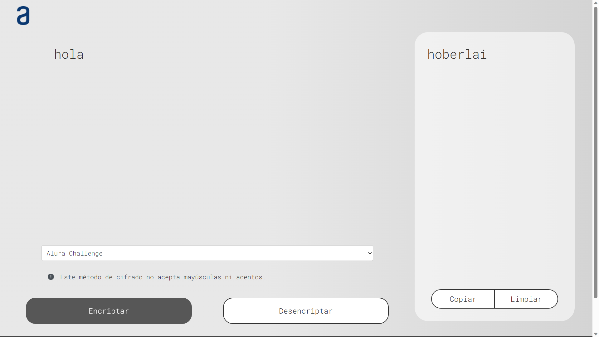
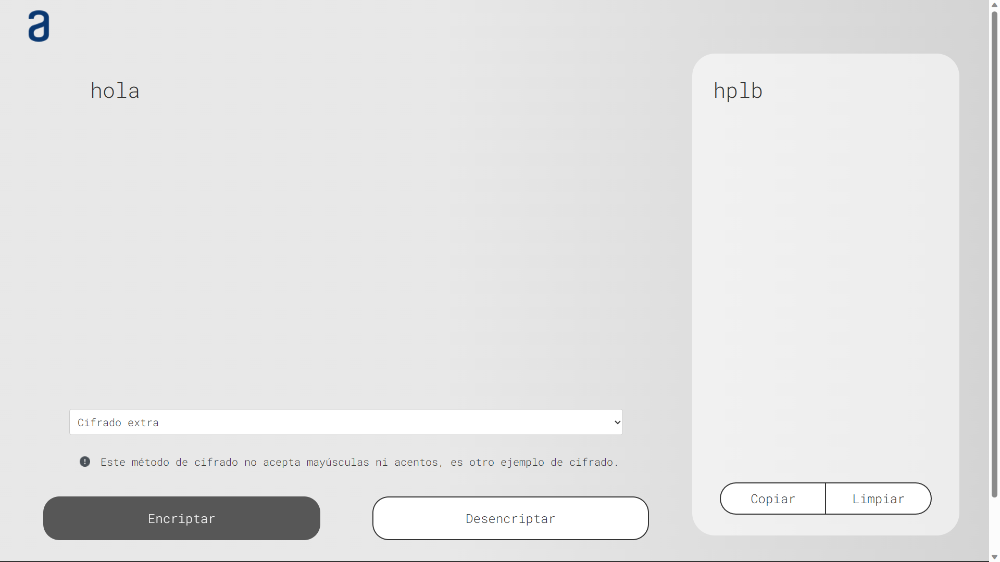

# Proyecto Encriptador - Challenge Alura

Este proyecto es parte del Challenge ONE: Principiante en programación. Es un encriptador de texto que utiliza diferentes métodos de cifrado para transformar el texto ingresado. Proporciona una interfaz simple y fácil de usar para encriptar y desencriptar mensajes.

## Características

- Cifrado utilizando métodos Alura Challenge y Cifrado Extra.
- Soporte para minúsculas, eliminando acentos y caracteres especiales.
- Opción para encriptar y desencriptar texto.
- Interfaz intuitiva con selección de método de cifrado, entrada de texto y visualización del resultado.
- Funcionalidad para copiar el resultado al portapapeles.
- Posibilidad de limpiar el texto y restablecer la interfaz.

## Capturas de pantalla

## Uso

1. Ingresa el texto que deseas encriptar o desencriptar en el área de entrada de texto.
2. Selecciona un método de cifrado de la lista desplegable.
3. Haz clic en el botón "Encriptar" o "Desencriptar" según la acción que desees realizar.
4. El resultado se mostrará en el área correspondiente.
5. Si deseas copiar el resultado al portapapeles, haz clic en el botón "Copiar".
6. Para limpiar el texto y restablecer la interfaz, haz clic en el botón "Limpiar".

## Tecnologías utilizadas

- HTML
- CSS
- JavaScript

## Diccionarios de Cifrado

### Alura Challenge

| Carácter Original | Carácter Cifrado |
|------------------|-----------------|
| e                | enter           |
| i                | imes            |
| o                | ober            |
| a                | ai              |
| u                | ufat            |

### Cifrado Extra

| Carácter Original | Carácter Cifrado |
|------------------|-----------------|
| a                | b               |
| e                | f               |
| i                | j               |
| o                | p               |
| u                | v               |

> **Nota:** Este diccionario es solo un ejemplo, para probar la posibilidad de escalar el proyecto con nuevos métodos de cifrado.
## Despliegue

El proyecto está desplegado en GitHub Pages. Puedes acceder a él a través del siguiente enlace: [Encriptador en GitHub Pages](https://RaymundoSGlz.github.io/encriptador)

## Contribución

Este proyecto forma parte del Challenge ONE: Principiante en programación. Aunque está diseñado como un ejercicio de aprendizaje, las contribuciones son bienvenidas. Si encuentras algún error, tienes alguna idea de mejora o deseas agregar nuevas funcionalidades, siéntete libre de hacerlo. ¡Tu participación es valorada!

Si tienes alguna duda relacionada con el proyecto o el Challenge ONE, también puedes compartirla. Estaré encantado de ayudarte.

## Autor

- [Raymundo Silvestre Gonzalez Contreras](https://github.com/RaymundoSGlz)

## Licencia

Este proyecto está bajo la [Licencia MIT](LICENSE).
